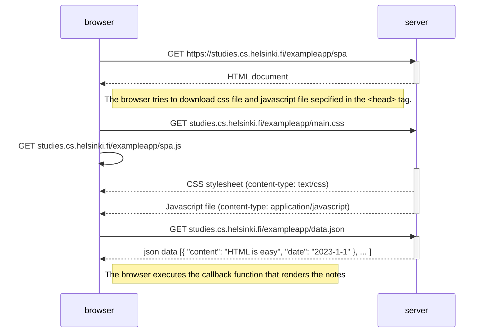

```mermaid
sequenceDiagram
    participant browser
    participant server

    browser->>server: GET https://studies.cs.helsinki.fi/exampleapp/spa
    activate server
    server-->>browser: HTML document
    deactivate server

    note right of browser: The browser tries to download css file and javascript file sepcified in the <head> tag.

    browser->>server: GET studies.cs.helsinki.fi/exampleapp/main.css
    browser->>browser: GET studies.cs.helsinki.fi/exampleapp/spa.js
    activate server
    server-->>browser: CSS stylesheet (content-type: text/css)
    server-->>browser: Javascript file (content-type: application/javascript)
    deactivate server

    browser->>server: GET studies.cs.helsinki.fi/exampleapp/data.json
    activate server
    server-->>browser: json data [{ "content": "HTML is easy", "date": "2023-1-1" }, ... ]
    deactivate server
    
    note right of browser: The browser executes the callback function that renders the notes
```
