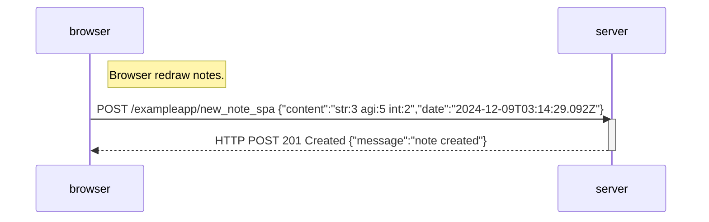

This has a difference from traditional app that, we don't reload the notes page upon submitting a new note. This has consequence:
+ Notes from other people (perhaps yourself, but in different device) in the meanwhile won't show up until we explicitly reload the spa page. Vice versa for your note in other people's showing page.
+ The order is not quite obvious. The client may render your added note next to the last note in the last loading, but after reloading, this adjacency may be lost since there may be notes from other devices in the meanwhile.
